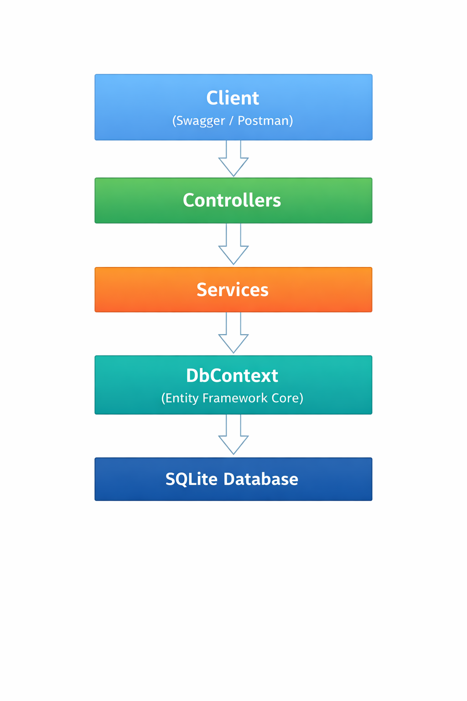

# AIExperimentTracker API

## Proje Açıklaması

**AIExperimentTracker**, .NET 9 kullanılarak geliştirilmiş bir RESTful Web API projesidir.
Bu proje, yapay zeka projelerinin ve bu projelere ait deneylerin (experiment) yönetilmesini amaçlamaktadır.

Bir kullanıcı birden fazla yapay zeka projesine sahip olabilir.
Her yapay zeka projesi birden fazla deney (experiment) içerebilir.
Her deney ise farklı değerlendirme metrikleri (metric) ile ölçülebilir.

Proje, derste anlatılan **katmanlı mimari (Layered Architecture)** yaklaşımına uygun olarak geliştirilmiştir.

## Kullanılan Teknolojiler

- .NET 9
- ASP.NET Core
- RESTful API
- Entity Framework Core
- SQLite
- Swagger / OpenAPI
- Git & GitHub


## Mimari Yapı

Projede katmanlı mimari uygulanmıştır.

### Mimari Diagram

Aşağıdaki diyagram, AIExperimentTracker projesinde kullanılan katmanlı mimariyi göstermektedir.




### Katmanlar

**Controllers**
HTTP isteklerini karşılar, request/response yönetimini yapar.

**Services**
İş kuralları ve iş mantığı bu katmanda bulunur.

**Data**
Entity Framework Core DbContext ve veritabanı yapılandırmaları.

**Entities**
Veritabanı tablolarını temsil eden sınıflar.

**DTOs**
API üzerinden veri alışverişi için kullanılan nesneler.

**Migrations**
Veritabanı şema değişiklikleri.


## Entity Yapıları ve İlişkiler
### Entity Listesi

- User
- AIProject
- Experiment
- Metric

### İlişkiler

- Bir User, birden fazla AIProject’e sahip olabilir.
- Bir AIProject, birden fazla Experiment içerebilir.
- Bir Experiment, birden fazla Metric ile değerlendirilebilir.

## Veritabanı Yapısı

ORM olarak **Entity Framework Core** kullanılmıştır.

Veritabanı olarak **SQLite** tercih edilmiştir.

Veritabanı, **Code First** yaklaşımı ile geliştirilmiş ve **Migration** kullanılarak oluşturulmuştur.

### Tablolar

- **Users**
  - Id (PK)
  - Email
  - Username
  - PasswordHash
  - CreatedAt
  - UpdatedAt

- **AIProjects**
  - Id (PK)
  - Name
  - Description
  - UserId (FK)
  - CreatedAt
  - UpdatedAt

- **Experiments**
  - Id (PK)
  - Name
  - Notes
  - ModelName
  - Status
  - AIProjectId (FK)
  - CreatedAt
  - UpdatedAt

- **Metrics**
  - Id (PK)
  - Name
  - Value
  - ExperimentId (FK)
  - CreatedAt
  - UpdatedAt

---

## Migration

Veritabanı şeması Entity Framework Core Migration mekanizması ile oluşturulmuştur.

Kullanılan komutlar:

```bash
dotnet ef migrations add InitialCreate
dotnet ef database update
```
## Seed Data

Uygulama ilk çalıştırıldığında veritabanına **başlangıç (seed) verileri**
otomatik olarak eklenmektedir.

Seed edilen veriler:

- Varsayılan bir **Admin User**
- Örnek bir **AIProject**
- Bu projeye bağlı bir **Experiment**
- Deneye ait örnek bir **Metric**

Seed işlemleri Entity Framework Core Migration mekanizması
üzerinden gerçekleştirilmiştir.


## API Response Formatı

Tüm API cevapları standart bir formatta döndürülmektedir:

```json
{
  "success": true,
  "message": "İşlem başarılı",
  "data": {}
}
```

## Endpoint Listesi
### User Endpoints
| Method | Endpoint | Açıklama |
|--------|----------|----------|
| GET    | /api/users | Tüm kullanıcıları getirir |
| GET    | /api/users/{id} | ID’ye göre kullanıcı getirir |
| POST   | /api/users | Yeni kullanıcı oluşturur |
| PUT    | /api/users/{id} | Kullanıcı günceller |
| DELETE | /api/users/{id} | Kullanıcı siler |


### Project Endpoints

| Method | Endpoint | Açıklama |
|--------|----------|----------|
| GET | /api/users/{userId}/projects | Kullanıcıya ait projeleri getirir |
| GET | /api/projects/{id} | ID’ye göre proje getirir |
| POST | /api/users/{userId}/projects | Kullanıcıya yeni proje ekler |
| PUT | /api/projects/{id} | Proje günceller |
| DELETE | /api/projects/{id} | Proje siler |


### Experiment Endpoints

| Method | Endpoint | Açıklama |
|--------|----------|----------|
| GET | /api/projects/{projectId}/experiments | Projeye ait experiment’leri getirir |
| GET | /api/experiments/{id} | ID’ye göre experiment getirir |
| POST | /api/projects/{projectId}/experiments | Projeye experiment ekler |
| PUT | /api/experiments/{id} | Experiment günceller |
| DELETE | /api/experiments/{id} | Experiment siler |


### Metric Endpoints

| Method | Endpoint | Açıklama |
|--------|----------|----------|
| GET | /api/experiments/{experimentId}/metrics | Experiment’a ait metrikleri getirir |
| POST | /api/experiments/{experimentId}/metrics | Experiment’a metrik ekler |
| DELETE | /api/metrics/{id} | Metrik siler |

## Minimal API Kullanımı

Ödev gereksinimleri doğrultusunda Minimal API kullanımı örnek olarak uygulanmıştır:
```text
GET /minimal/users
```

## Logging

Uygulamada .NET’in sunduğu **built-in logging** mekanizması (`ILogger`) kullanılmıştır.

- Controller seviyesinde bilgi (Information) logları alınmaktadır.
- Global Exception Middleware üzerinden beklenmeyen hatalar loglanmaktadır.
- Hatalar merkezi olarak yakalanarak standart API response formatında
  kullanıcıya döndürülmektedir.

Bu yapı sayesinde uygulamanın izlenebilirliği ve hata takibi sağlanmıştır.

Logging işlemleri ağırlıklı olarak **merkezi bir yapı**
(Global Exception Middleware) üzerinden yönetilmektedir.

Buna ek olarak, örnek olması amacıyla bazı controller’larda
`ILogger` kullanılarak bilgi seviyesinde loglama yapılmıştır.

Bu yaklaşım ile hem merkezi hata yönetimi sağlanmış,
hem de controller seviyesinde loglama örneği sunulmuştur.


## Swagger / OpenAPI

Swagger entegrasyonu yapılmıştır.  
Uygulama çalıştırıldıktan sonra Swagger arayüzüne aşağıdaki adresten erişilebilir:

```text
http://localhost:{port}/swagger
```
## Authentication & Authorization

Bu projede JWT (JSON Web Token) tabanlı authentication kullanılmıştır.

- Kullanıcı `/api/auth/login` endpoint’i üzerinden giriş yapar.
- Başarılı giriş sonrası JWT token üretilir.
- Token, `Authorization: Bearer {token}` formatında gönderilerek
  yetkili endpoint’lere erişilir.
- Endpoint’ler `[Authorize]` attribute’u ile korunmuştur.
- Role bilgisi JWT claim olarak eklenmiş ve role-based authorization uygulanmıştır.

## Soft Delete

Bu projede **Soft Delete** yaklaşımı uygulanmıştır.

- Veriler fiziksel olarak silinmemektedir.
- Tüm entity’lerde `IsDeleted` alanı bulunmaktadır.
- Silme işlemleri, ilgili kaydın `IsDeleted = true` olarak işaretlenmesi ile yapılmaktadır.
- Entity Framework Core **Global Query Filter** kullanılarak,
  silinmiş kayıtların otomatik olarak sorgulardan hariç tutulması sağlanmıştır.

Bu sayede veri bütünlüğü korunmuş ve geri dönüş imkânı sağlanmıştır.


## Kurulum ve Çalıştırma

### 1. Projeyi Klonla

```bash
git clone https://github.com/zeynepdas/AIExperimentTracker.git
cd AIExperimentTracker
```

### 2. Bağımlılıkları Yükle
```bash
dotnet restore
```

### 3. Veritabanını Oluştur
```bash
dotnet ef database update
```

### 4. Uygulamayı Çalıştır
```bash
dotnet run
```

## Git Versiyon Kontrolü

- Feature bazlı branch yapısı kullanılmıştır.

- Düzenli commit atılmıştır.

- GitHub üzerinden proje yönetimi yapılmıştır.


## Geliştirici

**Zeynep Daş**
Bilgisayar Mühendisliği
.NET 9 REST API Projesi